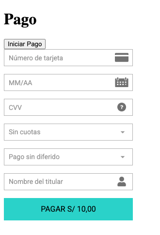

# Izipay - Pay Form JS

Fácil de integrar en su proyecto, con configuración mínima y proxy integrado.



## Instalación
```bash
npm i @dankira/izipay
```

## Ejemplo

Para obtener las credenciales de Izipay, es indispensable registrarse previamente en la plataforma gratuita: https://www.izipay.pe/izipay-online

> **⚠️ Importante**
> 
> Asegúrate de que las credenciales de la cuenta de Izipay estén correctamente configuradas antes de realizar cualquier pago. Si las credenciales son incorrectas, el pago fallará.

```js
import { setup, setInitialConfig, setPaymentConfig } from '@dankira/izipay'

setInitialConfig({
    merchant_code: '2352XXXX',
    production: false,
    test_password: 'testpassword_XXXX...',
    test_public_key: '2352XXXX:testpublickey_XXXX...',
    test_sha256: 'gwSUo27B8smXXX...',
})

// Configuración de monto, moneda y correo del cliente
setPaymentConfig({
    amount: 100,
    currency: 'PEN',
    customer: {
      email: 'antonyayansi@gmail.com'
    }
})

// Función callback para leer la transacción y devolver el pago
const readResponse = async (payment) => {
    console.log(payment); // Pago recibido
}
```

En la vista, se pueden utilizar frameworks como React, Vue, Angular, entre otros. <br /> La función setup recibe un solo parámetro: el callback donde se capturará la información del pago.

> **⚠️ Obligatorio**
> 
> Se debe crear un ```<div id="izipay-form"></div>``` al momento de llamar a la funcion ```setup()```

```html
<div>
    <button onclick="setup(readResponse)">Iniciar Pago</button>
    <div id="izipay-form"></div>
</div>
```
## Listo ☘️
Ya tienes implementado el formulario de pago de Izipay 🚀

### ⚙️ Opcional (Proxy URL)

```js
import { setup, setInitialConfig, setPaymentConfig } from '@dankira/izipay'

setInitialConfig({
    proxy_url: 'https://example.proxy/' // implemente un puente a: https://api.micuentaweb.pe/api-payment/V4/Charge/CreatePayment
})
```

## 🚨 Problemas Comunes
- CORS: Si experimentas problemas con CORS, asegúrate de que tu servidor permita las solicitudes desde tu dominio o utiliza un servidor proxy para manejar las solicitudes.
- Errores de autenticación: Verifica que la clave pública y las credenciales de la cuenta Izipay estén configuradas correctamente.

## 💬 Contribuciones
¡Las contribuciones son bienvenidas! Si encuentras errores o tienes sugerencias, por favor abre un issue o pull request. Asegúrate de seguir las pautas de contribución detalladas en el archivo CONTRIBUTING.md.

## 📜 Licencia
Este proyecto está bajo la Licencia MIT. Para más detalles, consulta el archivo LICENSE.

## 👥 Autor
## Antony Ayansi

[GitHub](https://github.com/antonyayansi) | [Twitter](https://x.com/_dankira_) | [LinkedIn](https://www.linkedin.com/in/antonyayansi/)